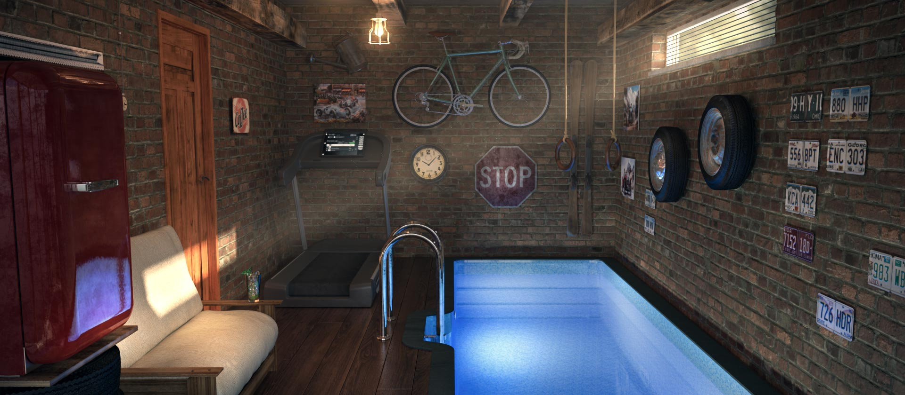

# Устройства для плавания
## Phlex Swim
https://www.phlexswim.com
https://www.youtube.com/@PhlexSwim
Приложение, которое основывается на измерении пульса от датчика Polar
Phlex и Polar объединились, чтобы обеспечить золотой стандарт плавательных технологий. Phlex предлагает передовые алгоритмы искусственного интеллекта для отслеживания результатов плавания, а Polar обеспечивает надежность датчиков и исключительный мониторинг сердечного ритма в реальном времени.

## Водный тренажер SwimTrack от FRANMER
https://swimtrack.ru
SwimTrack — это прямоугольная чаша из композитных материалов.
Такая же, как чаша бассейна, только гораздо меньше. У нас есть два размера чаш, которые подойдут для большинства гаражей:
Бассейн устанавливается по длине гаража, шириной 2 м, глубиной больше 1,5 метров. Благодаря системам противотока и Rubber Fitness, этот крошечный бассейн станет бесконечной плавательной дорожкой.
* Противоток создает течение и главное — это отличный подводный массаж.
* Rubber Fitness — это комфортный фиксатор для «плавания на месте».Обе технологии безопасны и проверены семьями во всем мире.

