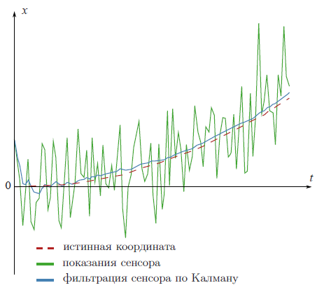

# Фильтр Калмана

|||
|-|-|
|Фильтр Калмана|https://habr.com/ru/articles/166693|

# Описание

Фильтр Калмана - это мощнейший инструмент фильтрации данных.
Основной его принцип состоит в том, что при фильтрации используется информация о физике самого явления. Скажем, если вы фильтруете данные со спидометра машины, то инерционность машины дает вам право воспринимать слишком быстрые скачки скорости как ошибку измерения. Фильтр Калмана интересен тем, что в каком-то смысле, это самый лучший фильтр.

