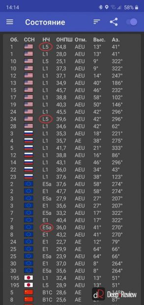
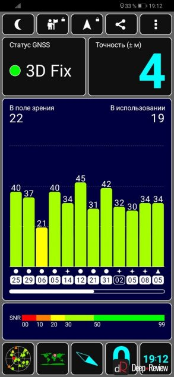

# Android
## Документация
- [Build location-aware apps ](https://developer.android.com/training/location)
- [Google Play services. Location](https://developers.google.com/android/reference/com/google/android/gms/location/package-summary)
- [android.location](https://developer.android.com/reference/android/location/package-summary)

## Термины
|Термин|Описание|
|-|-|
|GNSS|[Спутниковая система навигации](https://ru.wikipedia.org/wiki/Спутниковая_система_навигации)|
|Альманах|Таблица положений всех спутников, которым должен располагать любой спутниковый приёмник до начала измерений|
|Эфемериды|Это заранее просчитанные координаты движения спутника по своей орбите. Эта информация передается в закодированном сообщении, так как она известна заранее. Наземные станции следят за всеми спутниками и постоянно пересчитывают все координаты с учетом различных отклонений и обновляют эту информацию на спутниках.|
|Многолучево́е распространеение| это эффект, наблюдаемый при распространении сигналов. Возникает при условии существования в точке приема радиосигнала не только прямого, но и ещё одного или целого ряда отражённых или\и преломлённых лучей. Другими словами, на антенну приёмника приходят не только прямые лучи (непосредственно от самого источника), но и отражённые (от земной поверхности, зданий, строений и прочих объектов).|
|СРНС|Спутниковая радионавигационная система, типа ГЛОНАСС и GPS (NAVSTAR)|
|[DGPS](https://ru.wikipedia.org/wiki/Differential_GPS)|Системы дифференциальной коррекции - система повышения точности сигналов ГНСС заключающаяся в исправлении измеренных приемником псевдодальностей до спутников поправками к ним, полученными извне, от достоверного измерителя (базовая или опорная станция)|

## Спутниковые системы навигации
На 2020 год три спутниковые системы обеспечивали полное покрытие и бесперебойную работу для всего земного шара - [GPS](https://ru.wikipedia.org/wiki/GPS), [ГЛОНАСС](https://ru.wikipedia.org/wiki/ГЛОНАСС), [Бэйдоу](https://ru.wikipedia.org/wiki/Бэйдоу)

### Действующие и создаваемые спутниковые системы
|Система|Точность|Описание|
|-|-|-|
|[GPS](https://ru.wikipedia.org/wiki/GPS)|5 м (без DGPS)|Принадлежит министерству обороны США.   Этот факт, по мнению некоторых государств, является её главным недостатком. Устройства, поддерживающие навигацию по GPS, являются самыми распространёнными в мире.   Также известна под более ранним названием NAVSTAR.|
|[ГЛОНАСС](https://ru.wikipedia.org/wiki/ГЛОНАСС)|4,5 м - 7,4 м (без DGPS)|Принадлежит министерству обороны РФ.   Разработка системы официально началась в 1976 г., полное развёртывание системы завершилось в 1995 г. После 1996 года спутниковая группировка сокращалась и к 2002 году пришла в упадок. Была восстановлена к концу 2011 г. В настоящее время на орбите находится 127 спутников, из которых 122 используется по назначению. К 2025 году предполагается глубокая модернизация системы.|
|[Бэйдоу](https://ru.wikipedia.org/wiki/Бэйдоу)||Китайская глобальная спутниковая система навигации, основанная на геостационарных, геосинхронных спутниках и спутниках со средними орбитами.   Реализация программы началась в 1994 году. Первый спутник вышел на орбиту в 2000 году. По состоянию на 2015 год система имела 4 работающих спутников: 2 на геостационарных орбитах, 3 — на геосинхронных и 4 — на средних околоземных. 23 июня 2020 года был запущен 15 спутник системы «Бэйдоу», тем самым было завершено создание глобальной спутниковой системы навигации. 31 июля 2020 года председатель КНР Си Цзиньпин заявил о начале эксплуатации системы «Бэйдоу».|
|[DORIS](https://ru.wikipedia.org/wiki/DORIS)||Французская навигационная система.   Принцип работы системы связан с применением эффекта Допплера. В отличие от других спутниковых навигационных систем основана на системе стационарных наземных передатчиков, приёмники расположены на спутниках. После определения точного положения спутника система может установить точные координаты и высоту маяка на поверхности Земли. Первоначально предназначалась для наблюдения за океанами и дрейфом материков.|
|[Galileo](https://ru.wikipedia.org/wiki/Галилео_(спутниковая_система_навигации))|1 м (открытый сигнал), 0,01 м (закрытый)|Европейская система, находящаяся на этапе создания спутниковой группировки.   По состоянию на ноябрь 2016 года на орбите находится 16 спутников, 9 действующих и 7 тестируемых. Планируется полностью развернуть спутниковую группировку к 2020 году.|

### Создаваемые региональные спутниковые системы

|Система|Описание|
|-|-|
|[IRNSS](https://ru.wikipedia.org/wiki/IRNSS)|Индийская навигационная спутниковая система, в состоянии разработки. Предполагается для использования только в Индии. Первый спутник был запущен в 2008 году. Общее количество спутников системы IRNSS — 7.|
|[QZSS](https://ru.wikipedia.org/wiki/QZSS)|Японская квази-зенитная спутниковая система (Quasi-Zenith Satellite System, QZSS) была задумана в 2002 г. как коммерческая система с набором услуг для подвижной связи, вещания и широкого использования для навигации в Японии и соседних районах Юго-Восточной Азии. Первый QZSS-спутник был запущен в 2010 г. Предполагается создание группировки из трёх спутников, находящихся на геосинхронных орбитах, а также собственной системы дифференциальной коррекции.|

## Системы дифференциальной коррекции
Отдельные модели спутниковых приёмников позволяют производить т. н. «дифференциальное измерение» расстояний между двумя точками с большой точностью (сантиметры). Для этого измеряется положение навигатора в двух точках с небольшим промежутком времени. При этом, хотя каждое такое измерение имеет погрешность, равную 10-15 метров без наземной системы корректировки и 10-50 см с такой системой, измеренное расстояние имеет погрешность намного меньшую, так как факторы, мешающие измерению (погрешность орбит спутников, неоднородность атмосферы в данном месте Земли и т. д.) в этом случае взаимно вычитаются.

Кроме того, есть несколько систем, которые посылают потребителю уточняющую информацию («дифференциальную поправку к координатам»), позволяющую повысить точность измерения координат приёмника до 10 сантиметров. Дифференциальная поправка пересылается либо с геостационарных спутников, либо с наземных базовых станций, может быть платной (расшифровка сигнала возможна только одним определённым приёмником после оплаты «подписки на услугу») или бесплатной.

На 2009 год имелись следующие бесплатные системы предоставления поправок:
|NGSS|DGPS|Описание|
|-|-|-|
|[WAAS](https://ru.wikipedia.org/wiki/Wide_Area_Augmentation_System)|GPS|американская система|
|[СДКМ](https://ru.wikipedia.org/wiki/СДКМ)|ГЛОНАСС|Система Дифференциальной Коррекции и Мониторинга - широкозонная система дифференциальной коррекции для навигационных спутниковых систем ГЛОНАСС (РФ) и GPS (США).   Разработана АО «Российские космические системы»|
|[EGNOS](https://ru.wikipedia.org/wiki/EGNOS)|Galileo|европейская система|
|[MSAS](https://ru.wikipedia.org/wiki/MSAS)|QZSS|японская система|
|[GAGAN](https://ru.wikipedia.org/wiki/GAGAN)|||

Они основаны на нескольких передающих поправки геостационарных спутниках, позволяющих получить высокую точность (до 30 см).

Создание системы коррекции для ГЛОНАСС под названием СДКМ завершено к 2016.

## Что такое двухчастотный (L1+L5) GPS?

[Как работает навигация на смартфоне и что такое двухчастотный GPS](https://deep-review.com/articles/what-is-dual-frequency-gps)

Летом 2018 года компания Xiaomi с гордостью представила свой флагман Xiaomi Mi 8 с первым в мире двухчастотным GPS-модулем.

Все смартфоны до Xiaomi Mi 8 принимали сигнал от GPS-спутников только на одной частоте (1575 МГц), которая называется L1. Эту частоту поддерживают все до единого спутники: американские GPS, российские ГЛОНАСС, европейские Galileo и др.

Но в отличие от других смартфонов, Xiaomi Mi 8 умел принимать сразу два сигнала на разных частотах от одного и того же спутника.

Вторая частота (1176 МГц) получила название L5. Изначально она предназначалась для применения в ситуациях, от которых зависит жизнь человека, например, в авиации.

Такое одновременное использование двух частот позволяет устранить один из главных источников погрешности при определении координат - запаздывание сигнала, проходящего через ионосферу земли (атмосфера, ионизированная от облучения космическими лучами). Точно определить эту задержку невозможно. Но когда у нас появляется два сигнала разной частоты (а время запаздывания зависит от частоты), тогда определить влияние ионосферы нетрудно, исключив эту погрешность.

Кроме того, частота L5 на 3 дБ **мощнее**. То есть, этот сигнал **мощнее** в 2 раза сигнала L1, что упрощает его поиск и отслеживание. Также полоса пропускания частоты L5 в 10 раз **шире частоты** L1. И главное, этот сигнал менее подвержен искажениям от **многолучевости** (многочисленных отражений сигнала от зданий и других объектов, вызывающих искажения сигнала).

Все это позволяет действительно очень точно определять свои координаты. Однако по факту этого не происходит и многие пользователи Xiaomi Mi 8/9 на форумах жалуются на очень плохую работу GPS (даже хуже, чем в обычных устройствах).

### В чем же дело?

Для точного позиционирования недостаточно лишь добавить поддержку второй частоты. Огромную роль играет качество самой антенны и, конечно же, программное обеспечение. И на Xiaomi Mi 8 (как и на Android в целом) оно оставляет желать лучшего. По [этой ссылке](https://europepmc.org/article/PMC/6603672) можно почитать подробное исследование на эту тему, правда, текст на английском.

Очевидно, что спутники также должны отправлять сигналы на частоте L5, чтобы смартфоны могли их принимать. Но здесь не все так просто.

Российская система ГЛОНАСС вообще не поддерживает L5 (как и китайская BeiDou) и только планирует начать вещание на этой частоте после 2030 года.

Американская система NavStar (более известная под названием GPS) поддерживает частоту L5 только на 12 спутниках, но для полноценного покрытия всего земного шара их нужно минимум 24. Такое количество планируется запустить к 2021 году.

У европейской Galileo 22 рабочих GPS-спутника и все они поддерживают вещание на частоте L5a.

Японская система QZSS имеет всего 4 спутника, а к 2024 году их количество увеличится до 7 штук. Все они поддерживают L5 сигналы, но их количество ничтожно мало.

## Как определить, поддерживает ли мой смартфон двухчастотный GPS (L1+L5 частоты)?

Если вам интересно, поддерживает ли ваш смартфон двухчастотный GPS, вы можете самостоятельно это проверить. Для этого установите приложение [GPS Test](https://play.google.com/store/apps/details?id=com.android.gpstest&hl=en_US) и запустите его:

После запуска приложения смартфон начнет поиск всех GPS-спутников в зоне видимости, отображая частоту сигнала. Если на скриншоте будут частоты L5 или E5a (аналог L5 на европейских спутниках Galileo), значит, ваше устройство поддерживает двухчастотный GPS. Но, как уже было сказано ранее, не спешите радоваться, так как на текущий день такие устройства не показывают точность, на порядок (в десять раз) превышающую точность обычных GPS-модулей.

Если вы хотите измерять точность работы GPS своего смартфона и используете для этого приложение GPS Test, как на скриншоте ниже:

Тогда вам следует кое-что знать. Цифра 4 метра на скриншоте говорит лишь о следующем: если нарисовать круг, радиусом 4 метра, тогда ваше местоположение будет находиться где-то внутри этого круга с вероятностью 68%. То есть, существует 32% вероятность, что в действительности точность вашего GPS гораздо ниже. Поэтому, для проверки точности GPS-смартфона эта методика не лучшая.

