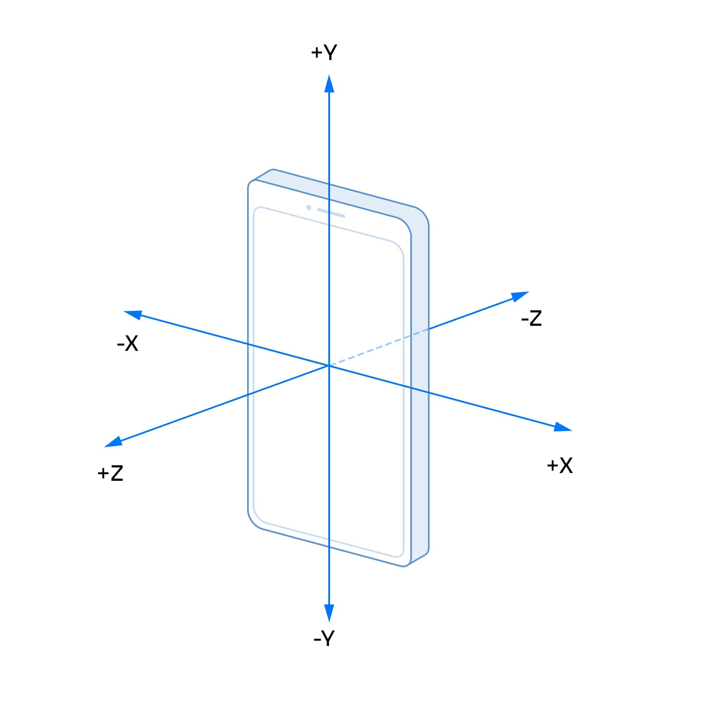
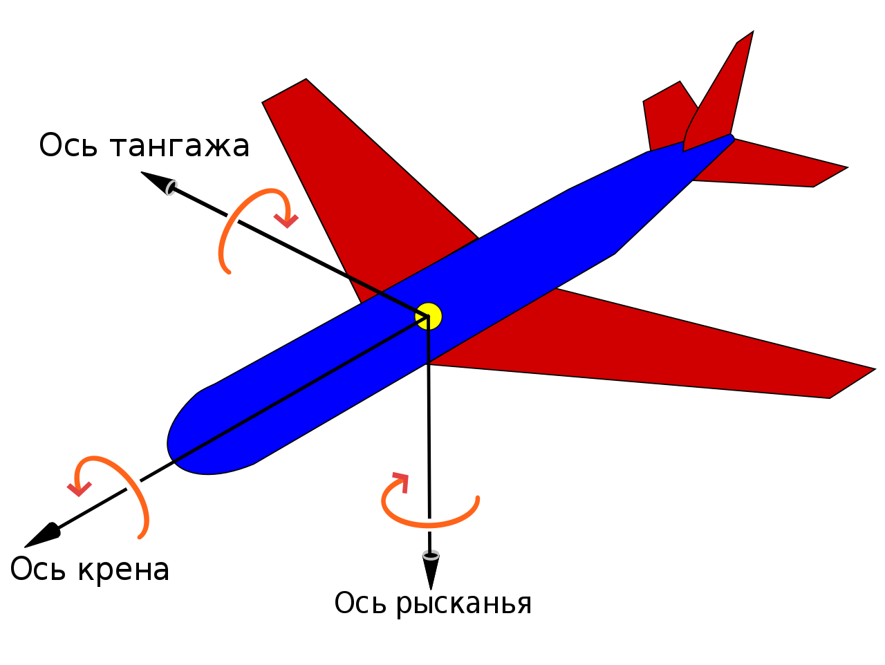
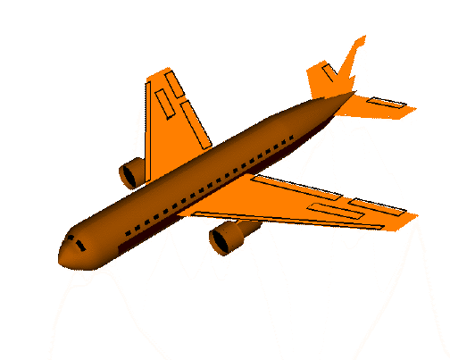

**Акселеро́метр (лат. accelero — ускоряю и др.-греч. μετρέω «измеряю»)** 

Акселерометр - датчик линейного ускорения

Акселерометр измеряет проекцию кажущегося ускорения (разницу между истинным и гравитационным ускорением). Таким образом определяется положение устройства относительно осей X, Y и Z. Знак числа (положительное или отрицательное) указывает на направление перемещения.

| sss | sss |
|----|----|
| Кажущееся ускорение | |
| Истинное ускорение | |
| Гравитационное ускорение | |
| Инерциальная скорость | |

Некоторые акселерометры также имеют встроенные системы сбора и обработки данных. Это позволяет создавать завершённые системы для измерения ускорения и вибрации со всеми необходимыми элементами. 

<<<<<<< HEAD

# Связанная система координат
[Связанная система координат (wiki)](https://ru.wikipedia.org/wiki/Связанная_система_координат)

> Крен / Рыскание / Тангаж

Связанная система координат - это подвижная система координат для анализа движения воздушных судов, с тремя осями, фиксированными относительно летательного аппарата:
- нормальной, 
- продольной, 
- поперечной

В России принята связанная система координат, в которой нормальная (вертикальная) ось направлена к верхней части самолета, начало нормальной системы координат совпадает с центром масс летательного аппарата.

На рисунке показаны направления осей, принятые за рубежом.

||||
|-|-|-|
|Продольная ось|Как правило, в качестве продольной оси используют строительную ось самолёта, которая закладывается при проектировании. При вращении вокруг неё самолёт опускает одну и поднимает другую консоль крыла. Такое движение называется «крен» (англ. roll).| Крен|
|Вертикальная ось|Вертикальная ось - ось, лежащая в плоскости симметрии самолёта и перпендикулярная его продольной оси. Вращение вокруг неё называется «рыскание» (англ. yaw). Самолёт при этом поворачивает нос влево или вправо.|Рысканье|
|Поперечная ось|Поперечная ось - это ось, перпендикулярная плоскости симметрии самолёта, направленная в сторону правой консоли крыла, дополняющая, таким образом, связанную систему координат до системы из трех векторов (они взаимно перпендикулярны и образуют ортогональный базис). При вращении вокруг этой оси самолёт опускает и поднимает нос. Это движение (и образуемый с горизонтальной плоскостью угол) называется «тангаж» (англ. pitch).| Тангаж|

# Инерциальная система навигации
[Инерциальная навигация (wiki)](https://ru.wikipedia.org/wiki/Инерциальная_навигация)
> Курсовертикаль

**Инерциальная навигация** - метод навигации (определения координат и параметров движения различных объектов - судов, самолётов, ракет и др.) и управления их движением, основанный на свойствах инерции тел, являющийся автономным, т. е. не требующим наличия внешних ориентиров или поступающих извне сигналов. Неавтономные методы решения задач навигации основываются на использовании внешних ориентиров или сигналов (например, звёзд, маяков, радиосигналов и т. п.).

Сущность инерциальной навигации состоит в определении ускорения объекта и его угловых скоростей с помощью установленных на движущемся объекте приборов и устройств, а по этим данным — местоположения (координат) этого объекта, его курса, скорости, пройденного пути и др., а также в определении параметров, необходимых для стабилизации объекта и автоматического управления его движением. 

Инерциальные навигационные системы (ИНС) имеют в своём составе датчики линейного ускорения (акселерометры) и угловой скорости (гироскопы или пары акселерометров, измеряющих центробежное ускорение). С их помощью можно определить отклонение связанной с корпусом прибора системы координат от системы координат, связанной с Землёй, получив углы ориентации: рыскание (курс), тангаж и крен. Угловое отклонение координат в виде широты, долготы и высоты определяется путём интегрирования показаний акселерометров. Алгоритмически ИНС состоит из курсовертикали и системы определения координат.
Курсовертикаль обеспечивает возможность определения ориентации в географической системе координат, что позволяет правильно определить положение объекта. При этом в неё постоянно должны поступать данные о положении объекта. Однако технически система, как правило, не разделяется и акселерометры, например, могут использоваться при выставке курсовертикальной части. 

## Теория устойчивости механических систем
[Теория устойчивости механических систем (wiki)](https://ru.wikipedia.org/wiki/Теория_устойчивости)
=======
>>>>>>> 9bd16d9d336d2551f5e475daaa031ecb1d5e0945
