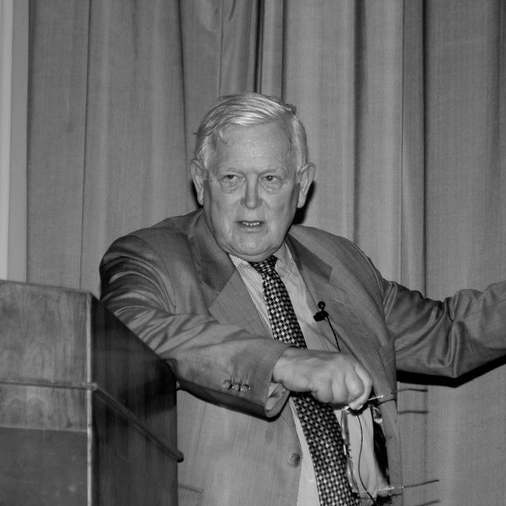

# Фильтр Калмана

Фильтр Калмана - это математический алгоритм, который позволяет оценивать состояние системы на основе неполной, зашумленной информации. Это может быть любая система, которую нужно контролировать или управлять (робот, дрон, автомобиль или процесс в производственной линии).

Фильтр Калмана был разработан Рудольфом Калманом в 1960 году и стал широко использоваться во многих областях, включая авиацию, автомобильную промышленность, медицину и даже бытовую технику. Он позволяет получать более точную оценку состояния системы, чем простое считывание данных с сенсоров.

